<h3>Virtual Machine Settings (Sanal Makine Ayarları)</h3>
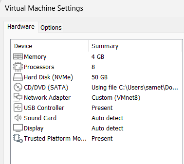

-Sanal makinemde performans ve verimliliği dengelemek adına 4GB RAM ve 2 çekirdekli CPU yapılandırması tercih ettim. Depolama tarafında, fiziksel disk alanını optimize etmek için 50GB kapasiteli Dinamik Genişleyen disk yapısını kullandım. Ağ mimarisinde VMnet8 (NAT) modunu seçerek, makineyi dış ağ trafiğinden izole ettim ihtiyaç duyulduğunda kontrollü servis erişimi sağlamak için port yönlendirme mantığını temel aldım.

 
 

-To balance performance and resource efficiency, I allocated 4GB of RAM and 2 processor cores. For storage, I implemented a 50GB dynamically expanding disk to optimize physical space utilization. Network-wise, I configured the VM on VMnet8 (NAT) to ensure isolation, while keeping port forwarding as a secure strategy for controlled service access.

 
 
 

<h3>Disk Adding And Expanding (Disk Ekleme Ve Genişletme) </h3>
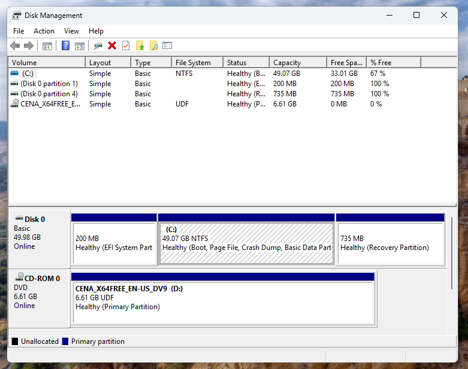
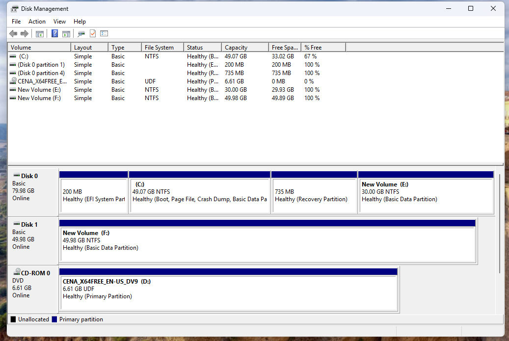

-Projede sanal makine üzerinde disk genişletme ve yeni disk ekleme işlemleri gerçekleştirdim.İlk görselde diskin işlem yapılmadan önceki hali yer almaktadır. İkinci görselde ise mevcut diski 30 GB genişlettim. Bu işlemi yapma sebebim, disk alanının yetersiz kalması ve aynı disk üzerinde çalışmaya devam edecek olmamdı.Daha sonra sisteme 50 GB boyutunda yeni bir disk ekledim. Bu diski farklı verileri depolamak için kullanarak ana sistem diskinde oluşabilecek doluluk sorunlarının önüne geçmeyi hedefledim.

 
 

-In this project, I performed disk extension and new disk addition operations on a virtual machine.In the first image, the disk is shown before any modifications. In the second image, I extended the existing disk by 30 GB due to insufficient storage space. Since I needed to continue working on the same disk, extending it was the most appropriate solution.After that, I added a new 50 GB disk to the system. I used this disk to store different types of data, aiming to prevent the main system disk from running out of space.

 
 
 

<h3>SnapShots</h3>
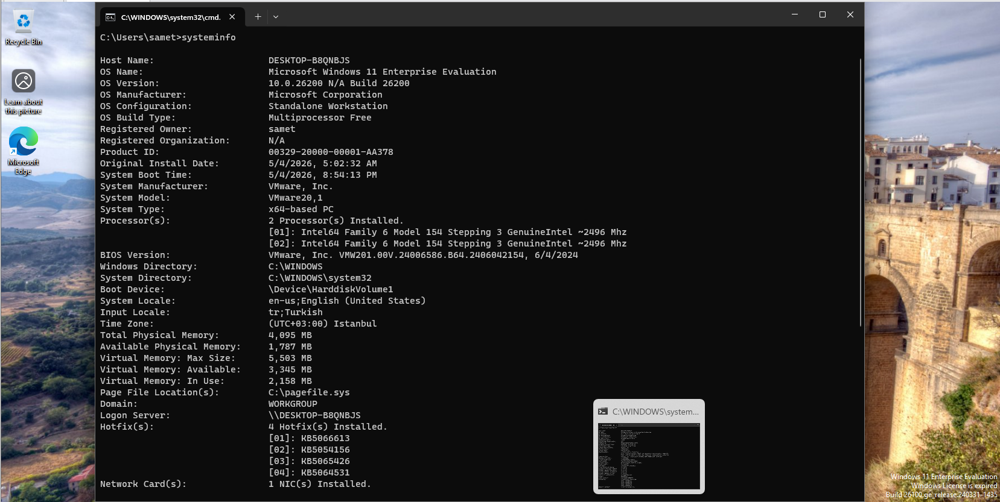

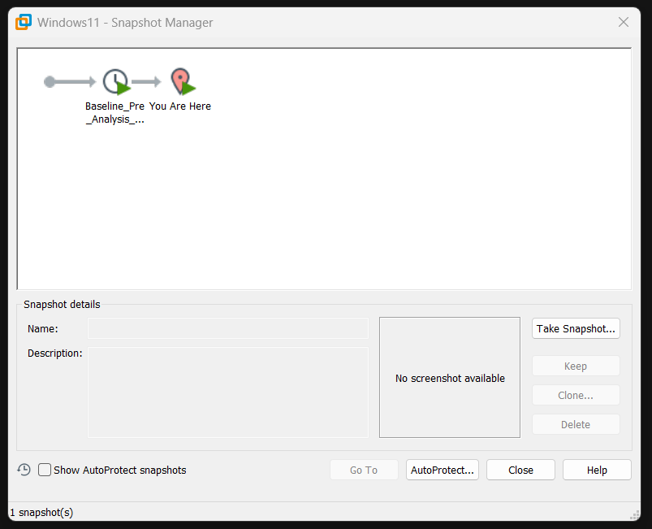
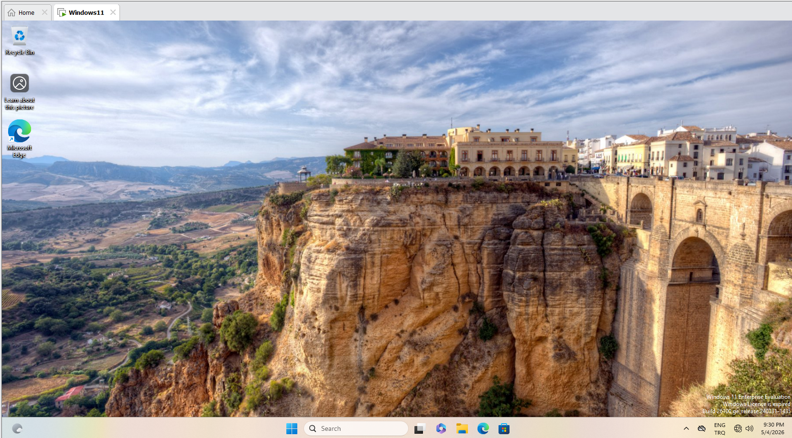
 
 
 
 
 
 
 
 

-Bu projede, sistemde yapılacak riskli işlemler öncesinde snapshot kullanımını test ettim.İlk görselde, herhangi bir işlem yapmadan önce sorunsuz ve stabil çalışan sistemin snapshot’unu aldım. Daha sonra sistem üzerinde şüpheli bir işlem gerçekleştirdim. İkinci görselde görüldüğü üzere bu işlem sonucunda sistemde siyah ekran hatası oluştu.Bu durum karşısında Snapshot Manager üzerinden daha önce aldığım snapshot’a geri dönerek sistemi kısa sürede eski, sorunsuz haline getirdim.Snapshot’lar, bu tür hatalı veya riskli işlemler sonrasında sistemi hızlıca geri yüklemek için oldukça etkili bir kurtarma yöntemidir. Ancak snapshot kullanımında zamanlama ve yönetimin doğru yapılması büyük önem taşır.

 
 

-In this project, I tested the use of snapshots before performing risky operations on the system.In the first image, I took a snapshot of the system while it was running smoothly and in a stable state. After that, I performed a suspicious operation on the system. As shown in the second image, this resulted in a black screen error.To resolve this issue, I used the Snapshot Manager to revert the system back to the previously taken snapshot, restoring it to a stable state in a short time.Snapshots are a very effective recovery method for quickly restoring systems after faulty or risky operations. However, proper timing and management of snapshots are crucial for their effective use.

 
 
 

<h3>Virtual Machine Cloning (Sanal Makine Klonlama)</h3>
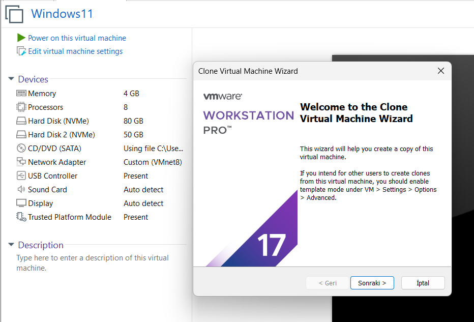
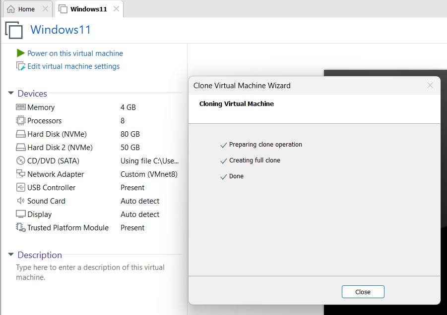
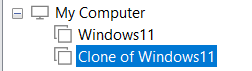
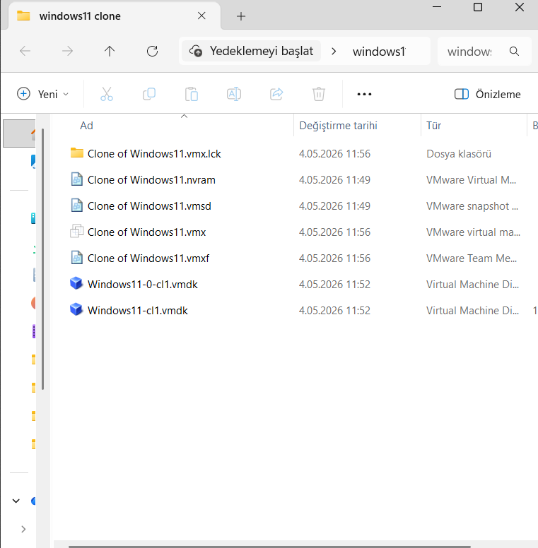

-Bu aşamada, kurduğum sanal makinenin klonunu oluşturdum. Bunun temel sebebi, aynı sistemi yeniden kurmanın zaman kaybı olmasıdır.Klonlama işlemi sayesinde mevcut sistemin birebir kopyasını alarak, bu kopya üzerinde istediğim işlemleri gerçekleştirebildim. Bu yöntem, hem zaman tasarrufu sağlar hem de ana sistemi riske atmadan test ve geliştirme yapma imkânı sunar.

 
 

-At this stage, I created a clone of the virtual machine I had set up. The main reason for this was to avoid the time-consuming process of rebuilding the same system from scratch.By cloning the virtual machine, I was able to create an exact copy of the existing system and perform my desired operations on the cloned environment. This approach saves time and allows testing and development without risking the main system.

 
 
 

<h3>Virtual Machine Export And İmport (Sanal Makine Dışa Aktarma ve İçeri Aktarma)</h3>
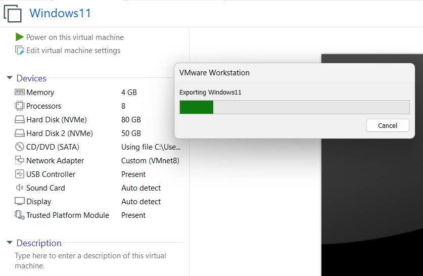
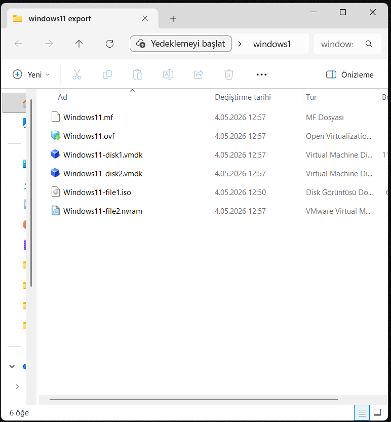
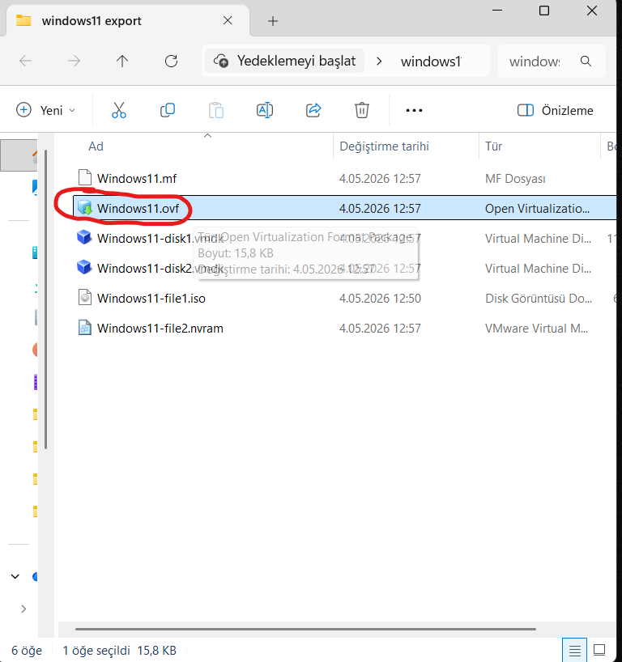
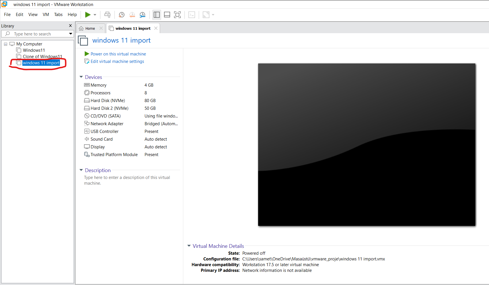
 
 
 
 
 
 
 
 
 
 

-Bu aşamada, ilk iki görselde export (dışa aktarma), son iki görselde ise import (içe aktarma) işlemlerini gerçekleştirdim.Export işlemini yapmamın amacı, oluşturduğum sanal makineyi farklı platformlara veya ortamlara kolayca taşıyabilmek ve kullanılabilir hale getirmektir. Bu sayede aynı sistemi yeniden kurmaya gerek kalmadan başka ortamlarda da çalıştırmak mümkün olmaktadır.
Import işlemi ise export edilen sanal makinenin farklı bir platforma veya ortama yeniden kurulmasını sağlar. Bu yöntem, sistem taşınabilirliği ve hızlı kurulum açısından büyük avantaj sunar.

 
 

-At this stage, I performed export operations in the first two images and import operations in the last two images.The purpose of the export process was to make the virtual machine portable across different platforms or environments and ensure it can be reused easily. This allows the same system to run in different environments without the need to rebuild it from scratch.The import process, on the other hand, enables the exported virtual machine to be installed and run on another platform or environment. This approach provides significant advantages in terms of system portability and rapid deployment.

 
 
 

<h3>Virtualization Networks (Sanallaştırma Networkleri)</h3>

-Sanallaştırma networkleri, sanal makinelerin (VM), host sistemlerin ve LAN yapılarının birbirleriyle iletişim kurmasını sağlamak için kullanılır. Farklı network türleri, farklı senaryolara göre erişim ve izolasyon seviyeleri sunar.
NAT (Network Address Translation) yapısında sanal makineler dış dünya ile iletişim kurabilir. Ancak dış sistemler, sanal makinelere doğrudan erişemez. Host veya LAN üzerinden VM’e erişim sağlanmak istenirse port yönlendirme (port forwarding) kullanılır. Bu yapı, sanal makineyi dış erişime karşı korur.
Bridge (Köprü) network ise sanal makineyi fiziksel bir cihaz gibi ağa dahil eder. VM, bulunduğu ağda bağımsız bir cihaz gibi davranır ve kendi IP adresini alarak doğrudan iletişim kurabilir.
Host-Only network yapısında sanal makineler sadece host makine ile ve kendi aralarında iletişim kurabilir. Dış LAN veya internet erişimi bulunmaz.
Internal network sadece sanal makinelerin birbirleriyle iletişim kurmasına izin verir. Host makine veya dış ağlarla herhangi bir bağlantı yoktur.
Son olarak Custom network, VMware üzerinde ihtiyaca göre özel ağ senaryoları oluşturulmasını sağlar. Kullanım amacına göre NAT, bridge veya izole yapıların özelleştirilmiş kombinasyonları oluşturulabilir.

 
 

-Virtualization networks are used to enable communication between virtual machines (VMs), host systems, and LAN environments. Different network types provide different levels of access and isolation depending on the scenario.
In a NAT (Network Address Translation) configuration, virtual machines can communicate with external networks, but external systems cannot directly access the VMs. If access is required from the host or LAN to the VM, port forwarding is used. This setup helps protect the virtual machine from direct external access.
A Bridge network connects the virtual machine directly to the physical network, making it behave like an independent device. The VM obtains its own IP address and can communicate directly within the network.
In a Host-Only network, virtual machines can only communicate with the host machine and with each other. There is no access to external LAN or the internet.
An Internal network allows communication only between virtual machines. The host system and external networks cannot access or communicate with this network.
Finally, a Custom network allows users to create tailored network configurations in VMware based on specific requirements. It can be used to design customized combinations of NAT, bridge, or isolated network structures depending on the scenario.

 
 
 
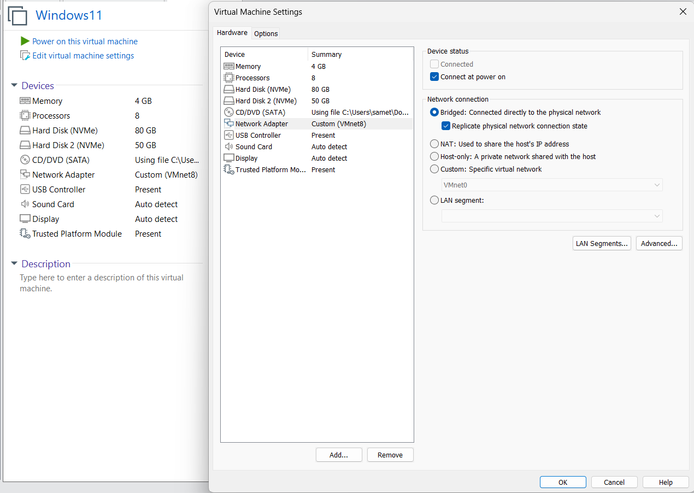
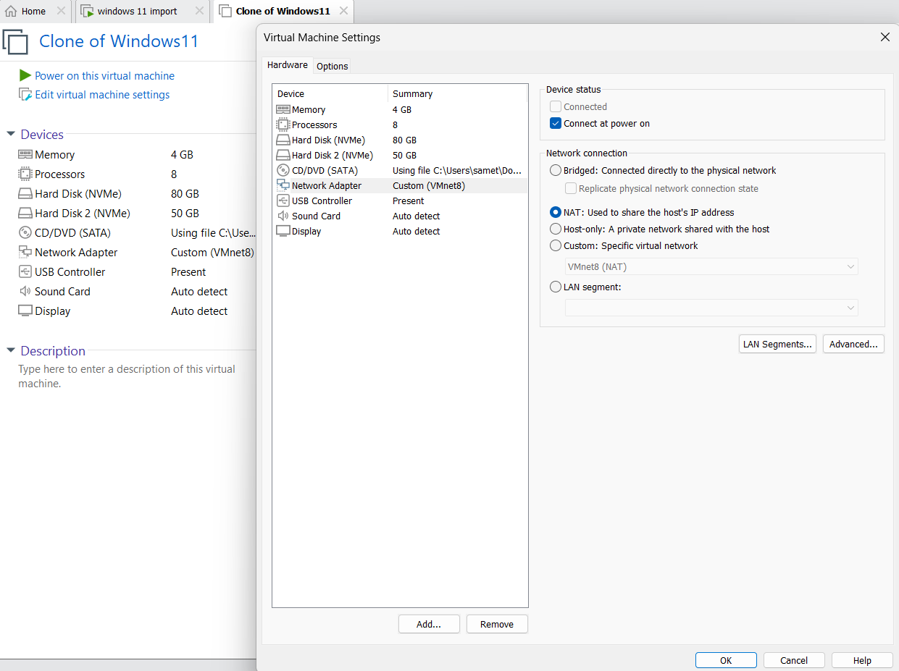
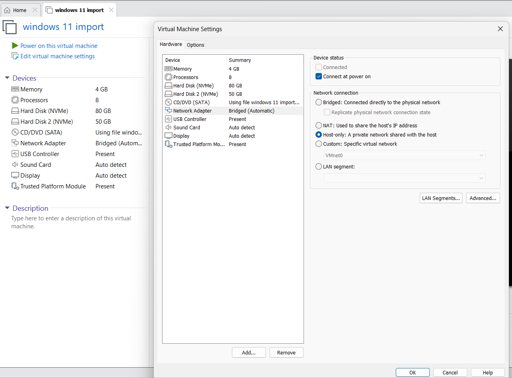
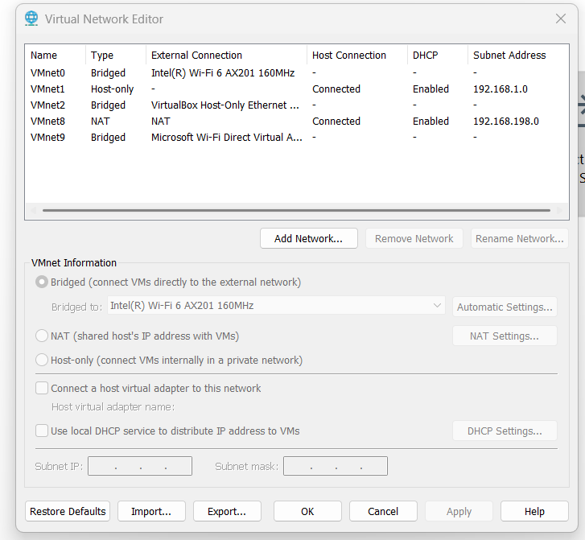

-Bu aşamada farklı sanal makineler için farklı network türleri yapılandırdım. İlk Windows 11 sanal makinemi Bridge, klon makineyi NAT, import ettiğim makineyi ise Host-Only olarak ayarladım.
Bridge olarak yapılandırdığım sanal makine, host sistemimin network’üne dahil oldu ve host ile aynı ağ yapısını kullanarak doğrudan iletişim kurabildi. Bu sayede host makineye ping atarak bağlantıyı doğruladım.NAT olarak ayarladığım sanal makine, VMware tarafından otomatik olarak atanan özel bir IP adresi aldı ve dış ağ ile NAT üzerinden iletişim kurabildi.Host-Only olarak yapılandırdığım sanal makine ise yalnızca host ve diğer sanal makineler arasında iletişim kurabilecek şekilde izole bir ağda çalışmaktadır.

 
 
 

-At this stage, I configured different network types for different virtual machines. I set my first Windows 11 virtual machine to Bridge, the cloned machine to NAT, and the imported machine to Host-Only.The virtual machine configured with Bridge mode became part of my host’s network and used the same network identity, allowing direct communication. I verified this by
successfully pinging the host machine.The NAT-configured virtual machine received a private IP address assigned by VMware and was able to communicate with external networks through NAT.The Host-Only virtual machine operates in an isolated network where it can only communicate with the host machine and other virtual machines, without access to external networks.

 
 
 

